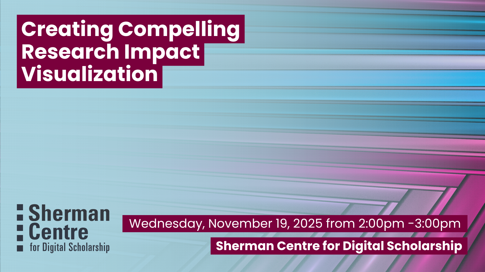

# Creating Compelling Research Impact Visualization

The ability to create effective visualizations of your research impact is a valuable skill when competing for grants, awards, and attention in a crowded research landscape. In this hands-on workshop, participants will create simple, eye-catching graphics to communicate impact from a variety of perspectives (from citation rates to collaboration networks to media attention).

Participants will learn how to: 
- Generate ready-made impact visualizations within a variety of bibliometric tools at McMaster. 
- Utilize raw bibliometric data and custom templates to create effective visualizations using Excel.  
- Effectively incorporate research impact visualizations into reports, grant applications, and award nominations. 

## Workshop Preparation 

None

## Facilitator Bio

Jack Young (he/him) is McMaster’s Research Impact Librarian, supporting the use of bibliometric data to enhance the reporting and strategic planning practices of the University’s academic departments, institutes, and researchers.

## Workshop Slides

<embed src="assets/docs/ImpactVisualizationWorkshop2025.pdf" style="border:none;" width="100%" height="466px">

[Download as PDF.](assets/docs/ImpactVisualizationWorkshop2025.pdf)

