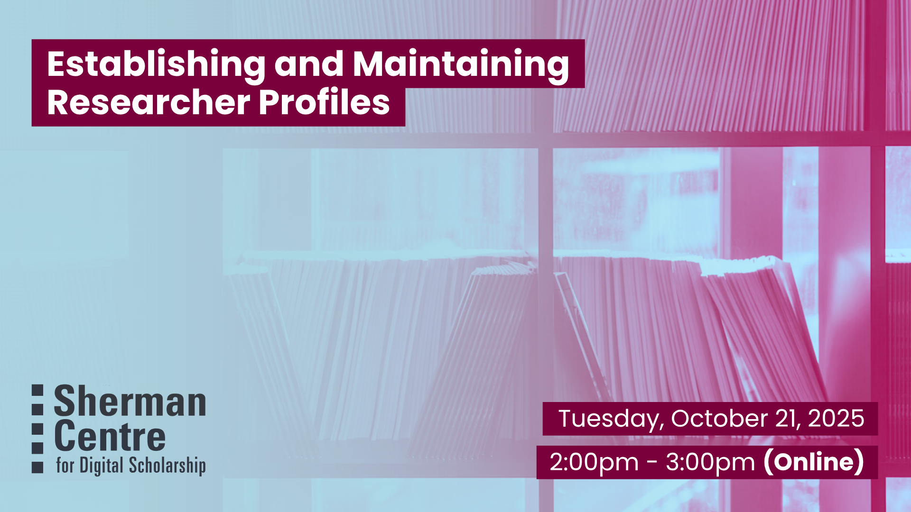

# Establishing and Maintaining Researcher Profiles

The ability to effectively track and express your research impact is an essential skill for today’s researchers. Profile tools like ORCID, Google Scholar, and McMaster Experts provide a valuable space to showcase your research outputs (from publications to datasets to creative works) and enable efficient workflows for demonstrating your impact. This workshop will guide researchers through the process of creating and maintaining researcher profiles — from initial setup to streamlined upkeep and generating basic impact reports.

By the end of this workshop, participants will be able to: 
- Select the most appropriate research profile(s) for their needs. 
- Automate the initial population and maintenance of their research profile(s). 
- Generate basic research impact reports using profile data.

No previous experience is neccessary. 

## Workshop Preparation 

None

## Facilitator Bio

Jack Young (he/him) is McMaster’s Research Impact Librarian, supporting the use of bibliometric data to enhance the reporting and strategic planning practices of the University’s academic departments, institutes, and researchers.

Sabrina Kirby (she/her) is the Research Technology Analyst for the McMaster Experts service, providing support to researchers and research administrations working with their Experts profiles and the varous systems and integrations that comprise McMaster Experts.

## Workshop Slides

<!-- <embed src="assets/docs/Creating-and-Sharing-Maps-with-ArcGIS-Online.pdf" style="border:none;" width="100%" height="466px">

[Download as PDF.](assets/docs/Creating-and-Sharing-Maps-with-ArcGIS-Online.pdf)-->