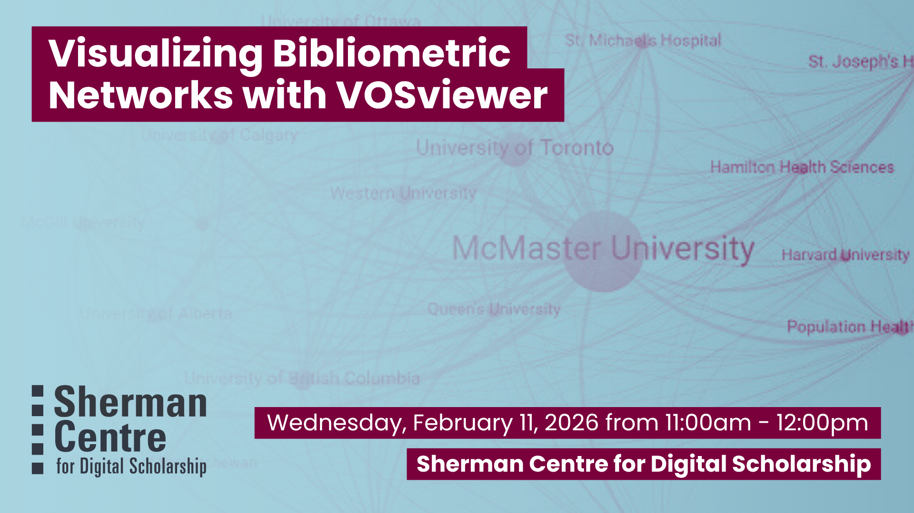

# Establishing and Maintaining Researcher Profiles

Curious about how research networks form and evolve? Bibliometric visualizations can help you uncover patterns in scholarly publishing—who’s collaborating, what topics are trending, and how ideas move across disciplines. In this hands-on workshop, you’ll learn how to use VOSviewer, a free and open-source tool designed specifically for visualizing bibliometric networks.

Using a large set of publication data, we’ll walk through techniques for analyzing connections at the organizational, author, and document levels, and build compelling network maps that bring bibliometric relationships to life.

By the end of this session, participants will be able to:
- Identify appropriate bibliometric techniques for analyzing large publication sets
- Create clear, compelling network visualizations using VOSviewer
- Interpret and explain bibliometric network maps to support research impact analysis and exploration

This session is ideal for researchers, librarians, and graduate students interested in research metrics, scholarly communications, or mapping academic influence. No prior experience with VOSviewer is required.

## Workshop Preparation 

Download VOSviewer [https://www.vosviewer.com/download](https://www.vosviewer.com/download) 

## Facilitator Bio

Jack Young (he/him) is McMaster’s Research Impact Librarian, supporting the use of bibliometric data to enhance the reporting and strategic planning practices of the University’s academic departments, institutes, and researchers.

## Workshop Slides

Coming soon.

<!-- <embed src="assets/docs/Creating-and-Sharing-Maps-with-ArcGIS-Online.pdf" style="border:none;" width="100%" height="466px">

[Download as PDF.](assets/docs/Creating-and-Sharing-Maps-with-ArcGIS-Online.pdf)-->